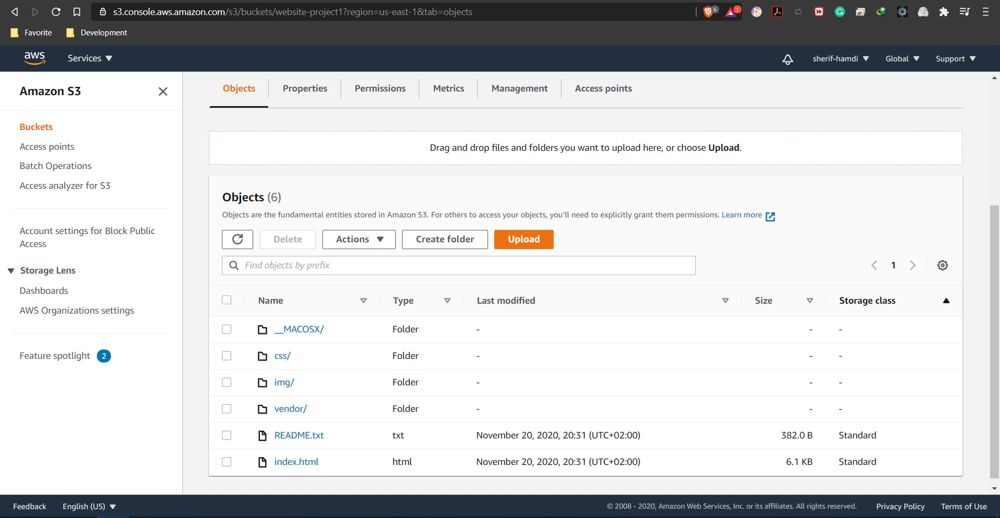
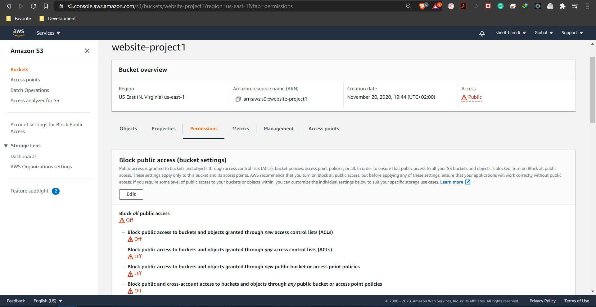
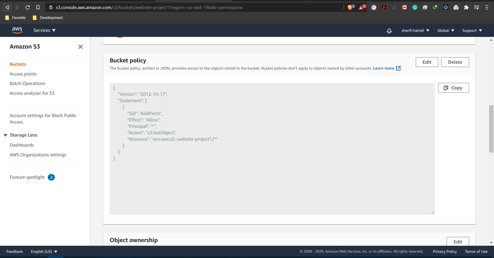
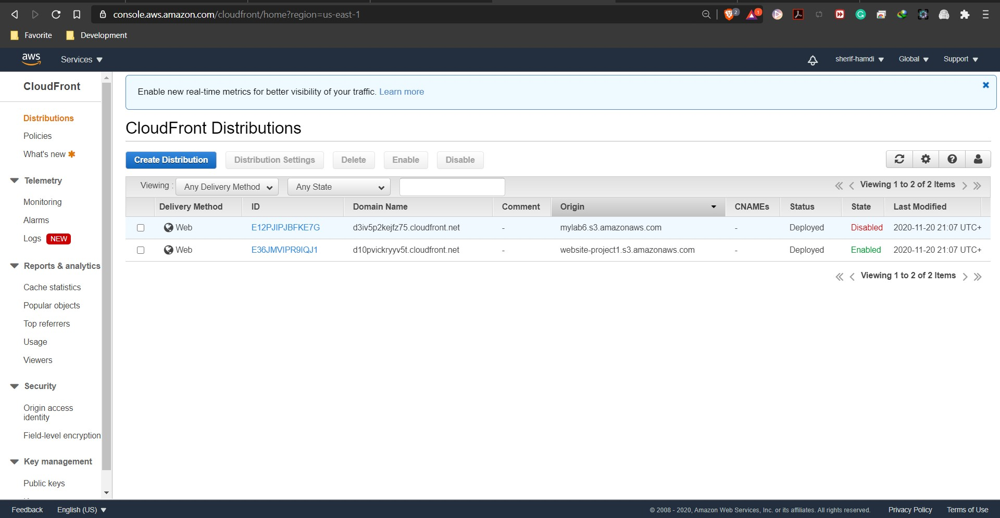
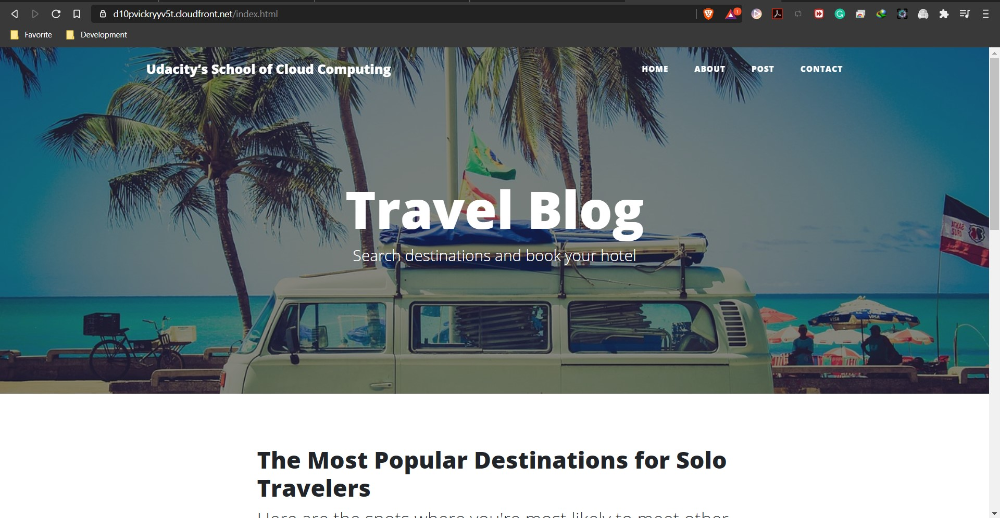

**Deploy Static Website on AWS**  
**Author**: Sherif Hamdi Ibrahim  
**Udacity DevOps Engineer Nanodegree**

CloudFront Endpoint:  
**https://d10pvickryyv5t.cloudfront.net/index.html**

***Steps***:  
1 - Create S3 Bucket on AWS and upload website files:  

2 - Secure bucket via IAM:  

3 - Bucket Policy:  

4 - Configure S3 bucket to host static website:  

5 - Create CloudFront distribution:  

6 - Access website in web browser:  

